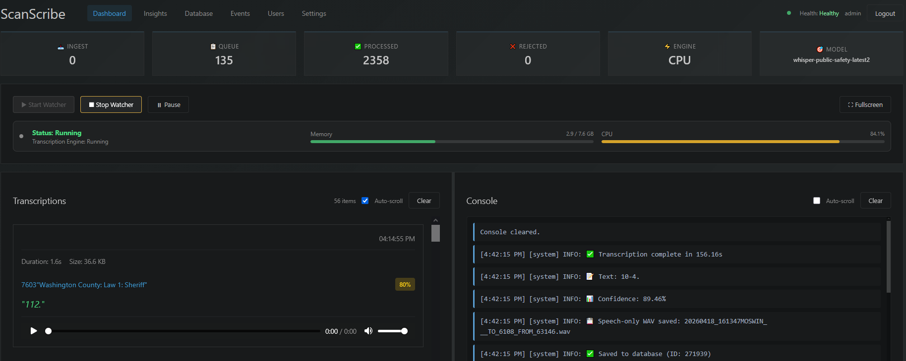
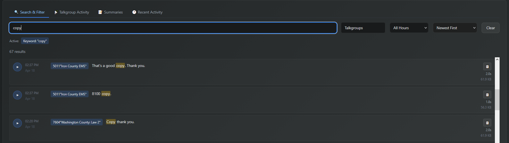
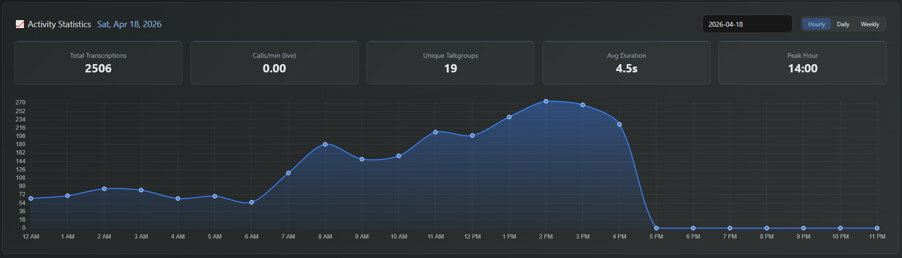

# ScanScribe
An open source AI powered transcription system designed for public safety radio scanning. Uses whisper AI to transcribe raw radio recordings then stores and catagorizes them in an advanced searchable database. Easy to use web UI. Has the ability to create detailed incident threads with local ollama hosted LLM's. Docker ready deployment for easy setup.

## Screenshots
### ScanScribe Dashboard


### Search and advanced filtering


### Insights Dashboard


## Features

- **Whisper transcription** — multi-worker, VAD-filtered, CPU or GPU
- **Events pipeline** — NER → Worker LLM (opens incidents) → Master LLM (attach/skip/close) → header normalizer → summary
- **Ollama LLM integration** — local model routing, header normalization, and event summaries (no cloud required)
- **Incident management** — open/close/reopen events, paginated archive, pipeline activity log, auto-close stale events by incident time
- **Insights** — per-hour summaries via Gemini API or auto-generation
- **ScanScribe client** — lightweight Windows uploader for ProScan integration
- **Multi-user auth** — JWT-based login, user management
- **Real-time Web UI** — WebSocket live updates, modern dark web interface

## Prerequisites

- Docker & Docker Compose
- Ollama (local or remote) with your chosen models loaded
- NER model (`models/incident_ner_*`) — custom public-safety NER
- Whisper model (`models/whisper-*`)
- 8 GB+ RAM recommended; 16+ GB if running Ollama on the same host

## Quick Start

### 1. Clone & configure environment

```bash
cp .env.example .env
# Edit .env — set SECRET_KEY (required)
openssl rand -hex 32   # generate a key
```

### 2. Configure `config.yml`
**Events pipeline is DISABLED by default.**

It's recommened to use whisper-small fined tuned on public safety audio. There is no official release for a finetuned model as of now. Just use the base whisper-small model available here on [Huggingface.](https://huggingface.co/openai/whisper-small)

Key sections to set before first run:
```yaml
model:
  name: <your-whisper-model-dir>   # folder name inside ./models/
  workers: 4                        # parallel transcription threads

events_pipeline:
  enabled: false
  ner_model_path: ./models/incident_ner_<version>
  llm_routing: true
  auto_close_stale_seconds: 3600    # close events idle > 1 hour
  cleanup_interval_seconds: 300     # sweep every 5 min

incidents_ollama:
  enabled: false
  base_url: "http://<ollama-host>:11434"
  worker_model: "gemma4:latest"     # cheap triage model
  master_model: "qwen3.5"           # routing + header + summary
```

### 3. Build & run

```bash
docker-compose up -d
```

Open `http://<host>:8000` — register your first account.

## Architecture

```
ScanScribe Container (port 8000)
│
├── FastAPI web service
│   ├── Auth / Users
│   ├── Transcriptions / Logs
│   ├── Events pipeline API
│   ├── Insights (hour summaries)
│   └── Settings / Maintenance
│
├── Transcription engine (Whisper, multi-worker)
├── File watcher (./ingest or client HTTP upload)
│
├── Events pipeline
│   ├── NER service  →  SpanStore
│   ├── Worker LLM   →  opens new incidents
│   ├── Master LLM   →  attach / skip / close
│   ├── Header normalizer (event_type, location, units, status_detail)
│   ├── Event summary generator
│   └── Cleanup worker (auto-close stale by incident time)
│
└── Databases (SQLite)
    ├── scanscribe.db        (users, config)
    ├── scanscribe_logs.db   (transcription log entries)
    └── scanscribe_events.db (monitors, events, links, debug logs)
```

## Events Pipeline
You can find my fine-tuned NER model here on [huggingface.](https://huggingface.co/xxbubziexx/incident_ner_v1)

The pipeline processes every transcription through:

1. **NER** — extracts `EVT_TYPE`, `LOC`, `UNIT`, `ADDRESS`, etc.
2. **Worker LLM** (cheap model) — decides if an `EVT_TYPE` span should open a new incident
3. **Master LLM** (stronger model) — routes spans to open events: `attach`, `skip`, or `close`
4. **Header normalizer** — runs on create, every N attaches (`normalize_every_n_spans`), and on close; fills structured header fields from transcripts
5. **Summary generator** — chains after header normalization in the same thread once `summary_trigger_spans` is reached
6. **Cleanup worker** — background sweep that auto-closes events whose last radio transmission timestamp exceeds `auto_close_stale_seconds`

Configure monitors (talkgroup → monitor mapping) from the Events page.

## Configuration

All runtime settings live in **`config.yml`**. Environment variables in **`.env`** handle secrets and paths only.

### `.env` variables

| Variable | Description |
|---|---|
| `SECRET_KEY` | **Required.** JWT signing key |
| `ACCESS_TOKEN_EXPIRE_MINUTES` | Token lifetime (default 60) |
| `INGEST_DIR` | Audio drop directory |
| `OUTPUT_DIR` | Processed audio storage |
| `LOG_DIR` | App logs |
| `DB_PATH` | Main SQLite DB path |
| `CONFIG_PATH` | Path to `config.yml` |
| `OMP_NUM_THREADS` / `MKL_NUM_THREADS` / `TORCH_NUM_THREADS` | PyTorch CPU thread limits |

### Key `config.yml` sections

| Section | Purpose |
|---|---|
| `model` | Whisper model name, path, workers, device |
| `transcription` | VAD, beam size, silence removal |
| `events_pipeline` | NER path, LLM routing, auto-close, normalize interval |
| `incidents_ollama` | Ollama URL, worker/master model names, timeout |
| `gemini` | Gemini API key and model for hour summaries |
| `summaries` | Auto-generation schedule |
| `storage` | Audio retention, cleanup hour |
| `logging` | Log level, rotation |

## ScanScribe Client

A lightweight audio file uploader for Windows. Available here: [Uploader Client on Github](https://github.com/xxbubziexx/Scanscribe-Uploader-Client). This is an active folder watcher for your scanner recording software recording directory. It uploads all recordings to the scanscribe server. Configurable in config.yml.

## Docker Commands

```bash
# Start
docker-compose up -d

# View logs
docker-compose logs -f

# Rebuild after code changes
docker-compose up -d --build

# Stop
docker-compose down

# Health check
curl http://localhost:8000/health
```

## Development

```bash
python -m venv venv
source venv/bin/activate
pip install -r requirements.txt

# Copy and edit config
cp config.yml.example config.yml   # if present, else edit config.yml directly
cp .env.example .env

uvicorn app.main:app --reload --host 0.0.0.0 --port 8000
```

## Project Structure

```
scanscribe/
├── app/
│   ├── main.py                    # FastAPI app + lifespan startup
│   ├── config.py                  # Pydantic config schema + loader
│   ├── database.py                # SQLAlchemy sessions (3 DBs)
│   ├── models/                    # SQLAlchemy models
│   │   ├── user.py
│   │   ├── log_entry.py
│   │   ├── event.py               # Monitor, Event, EventTranscriptLink, SpanStore
│   │   └── hour_summary.py
│   ├── routes/                    # FastAPI routers
│   │   ├── auth.py, users.py
│   │   ├── logs.py, transcriptions.py, upload.py
│   │   ├── events.py              # Events pipeline API
│   │   ├── insights.py, settings.py, maintenance.py, watcher.py
│   ├── services/                  # Business logic
│   │   ├── events_worker.py       # NER → Worker → Master pipeline
│   │   ├── ollama_event_routing.py # Master LLM routing
│   │   ├── master_event_header_ollama.py
│   │   ├── event_summary_ollama.py
│   │   ├── ollama_worker.py       # Worker LLM triage
│   │   ├── ner_service.py
│   │   ├── events_common.py, events_debug.py
│   │   ├── transcription_engine.py
│   │   ├── queue_processor.py
│   │   ├── watcher.py
│   │   └── summaries_auto.py
│   ├── templates/                 # Jinja2 HTML pages
│   └── static/                    # CSS + JS
├── models/                        # Whisper + NER model weights
├── data/                          # SQLite databases (persistent)
├── logs/                          # Application logs
├── ingest/                        # Audio drop directory
├── Dockerfile
├── docker-compose.yml
├── config.yml
└── requirements.txt
```

## Troubleshooting

**Events not routing** — check `incidents_ollama.enabled: true` and `llm_routing: true` in `config.yml`. Verify Ollama is reachable at `base_url`.

**Header never fills** — check pipeline activity log on the Events page. Confirm `master_header_normalize: true` and the master model is loaded in Ollama.

**Stale events not closing** — both `auto_close_stale_seconds` and `cleanup_interval_seconds` must be > 0.

**Container won't start** — `docker-compose logs scanscribe`

**Database locked** — SQLite DBs live in `./data/` (persistent bind mount), not in the container layer.

**Model not found** — verify `model.name` in `config.yml` matches the folder name inside `./models/`.

## Security Notes

- Set a strong `SECRET_KEY` in `.env` before deployment
- Use an HTTPS reverse proxy (nginx, Traefik, Caddy) in production
- Restrict the Ollama host to your LAN
- The web interface and API have no rate limiting by default

## License

Proprietary — ScanScribe Project
