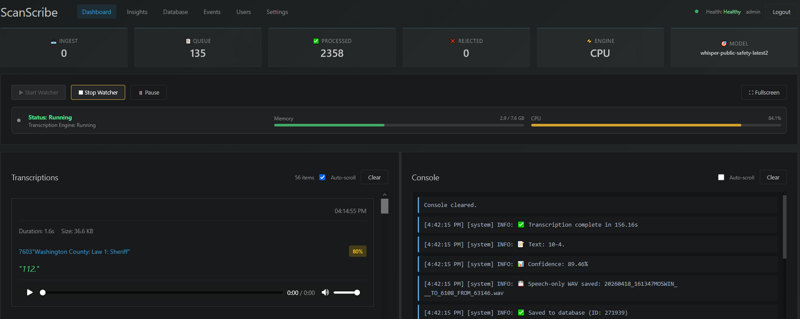
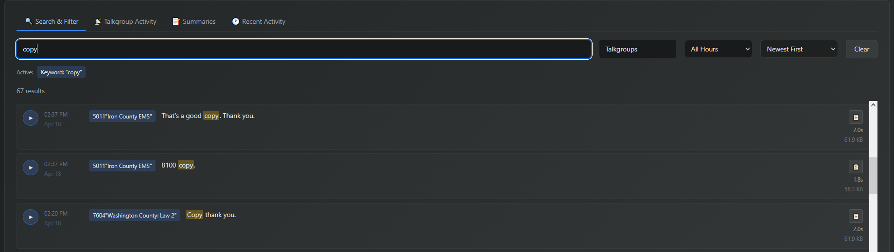
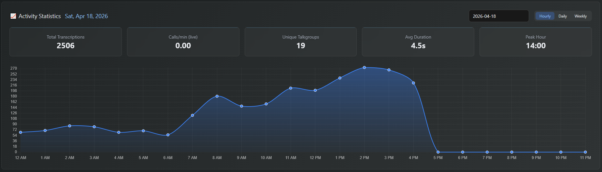

# ScanScribe

An open-source, AI-powered transcription and incident intelligence system purpose-built for public safety radio scanning. ScanScribe captures raw radio transmissions from SDR receivers or scanner software, transcribes them with OpenAI Whisper, extracts critical entities with custom NER, routes dispatches into live incident threads via LLMs, and maps them in real time on an interactive tactical Command Center.

---

## Screenshots

### Tactical Command Center & Live Map
*Interactive map with draggable pins, auto-reverse geocoding, address autocomplete, and inline audio playback.*

### ScanScribe Dashboard & Live Feed


### Search and Advanced Filtering


### Real-Time Insights & Activity Analytics


---

## Key Features

- **High-Performance Whisper Transcription**
  - Multi-worker parallel processing, Voice Activity Detection (VAD) filtering, and silence removal.
  - Native support for both **CPU** (optimized multi-threading) and **NVIDIA GPU** (CUDA acceleration).
- **Tactical Command Center & Live Map**
  - Real-time incident mapping powered by Leaflet and OpenStreetMap Nominatim (100% free, no API keys required).
  - **Draggable Markers**: Drag and release any pin to automatically update incident coordinates and reverse-geocode to the nearest street address.
  - **Type-Ahead Address Search**: Instant autocomplete search bar on incident cards to quickly find and pin locations.
  - **Corridor & Highway Midpoint Geocoding**: Automatically resolves directional highway dispatches (e.g. *Southbound US Highway 67*) to the highway corridor within the monitor's county jurisdiction.
  - **Custom Landmark Aliases**: Built-in and config-extensible landmark resolver (e.g. local restaurants, parks, mile markers).
  - **Inline Radio Dispatch Player**: Compact audio waveform player directly on incident cards for instant transmission verification.
- **AI Events Pipeline & Incident Routing**
  - Public-safety entity extraction (NER) identifies event types, units, addresses, and cross-streets.
  - **Single-Pass LLM Router**: Fast, robust routing powered by OpenRouter (Gemini, Claude, or free tier models) or local Ollama instances.
  - Automatically manages incident lifecycles (`CREATE`, `ATTACH`, `CLOSE`, `BROADCAST`), normalizes headers, and generates thread summaries.
  - **Absolute Truth Known Units**: Configure known unit identifiers per monitor/department to eliminate hallucinated callsigns.
- **Dataset Studio & Fine-Tuning Pipeline**
  - In-browser review tool to inspect transcriptions against raw audio, edit corrections, and tag reviewed samples.
  - **1-Click Fine-Tuning Export**: Exports reviewed audio and HuggingFace-compatible `metadata.csv` for fine-tuning custom Whisper models.
- **Enterprise-Grade Web Interface & Security**
  - Fast, modern React SPA (Vite, TypeScript, Tailwind CSS, dark tactical theme).
  - Real-time WebSocket streaming for zero-latency dashboard updates.
  - Raw console output & real-time pipeline event trace terminals.
  - JWT authentication with automatic **Admin promotion on first registration** and SlowAPI rate-limiting protection.

---

## Prerequisites

- **Docker & Docker Compose** (v2.0+)
- **Python 3.8+** (for running the setup wizard)
- **Whisper Model** (`models/whisper-*`) placed inside `./models/`
- **NER Model** (`models/incident_ner_*`) placed inside `./models/`
- **Hardware Requirements:**
  - 8 GB+ RAM recommended for CPU transcription.
  - 16 GB+ RAM / NVIDIA GPU (6 GB+ VRAM) recommended for GPU transcription or local LLM execution.

---

## Fast Interactive Setup (Recommended)

ScanScribe provides an automated setup wizard (`setup.sh` / `setup.ps1` / `setup.py`) that checks your system, generates security keys, configures CPU or GPU hardware acceleration, and initializes your environment in under a minute.

### Step 1: Install Prerequisites
1. **Docker Desktop / Docker Engine:**
   - **Windows & macOS:** Download and start [Docker Desktop](https://www.docker.com/products/docker-desktop/).
   - **Linux:** Install [Docker Engine & Compose Plugin](https://docs.docker.com/engine/install/).
2. **Python 3.8+:**
   - Ensure Python is installed on your host system (`python3 --version` or `python --version`).

### Step 2: Clone the Repository
```bash
git clone https://github.com/xxbubziexx/ScanScribe.git
cd ScanScribe
```

### Step 3: Run the Setup Wizard
Launch the setup script for your operating system:

- **Linux / macOS / Git Bash:**
  ```bash
  ./setup.sh
  ```
- **Windows (PowerShell):**
  ```powershell
  .\setup.ps1
  ```
  *(If blocked by Windows execution policy, run: `powershell -ExecutionPolicy Bypass -File .\setup.ps1`)*
- **Universal (Any OS with Python):**
  ```bash
  python setup.py
  ```

### Step 4: Interactive Prompts
The wizard will guide you through:
1. **Hardware Acceleration:** Automatically checks for an NVIDIA GPU via `nvidia-smi`. Select `[1] CPU` or `[2] GPU (CUDA)`. The wizard copies the matching `docker-compose.yml` and `requirements.txt` pair and sets `device` in `config.yml`.
2. **Admin Password:** Sets the initial password for the default `admin` account.
3. **Local Timezone:** Sets your local timezone (e.g. `America/Chicago`, `America/New_York`, `UTC`).
4. **Instant Boot:** Optionally launches the container immediately via Docker Compose.

### What the Setup Script Automates:
- [x] Generates a cryptographically secure 64-character random `SECRET_KEY` in `.env`.
- [x] Configures `docker-compose.yml` and `requirements.txt` for CPU or GPU.
- [x] Sets up `config.yml` with the correct device and worker threads.
- [x] Bootstraps initial administrator credentials in `.env`.
- [x] Creates all required folders (`./data`, `./logs`, `./audio_storage`, `./models`).
- [x] Validates model directories and launches `docker compose up -d --build`.

### Step 5: Access the Web Interface
Once started, navigate to:
**`http://localhost:8000`**

Log in using your administrator credentials:
- **Username:** `admin`
- **Password:** *(the password chosen during setup, default: `admin`)*

*(Note: On any fresh installation, the very first user who registers through the web interface is also automatically granted full Administrator privileges).*

---

### Non-Interactive & Automated Deployments (CLI Flags)
For automated scripting, server provisioning, or CI/CD pipelines, pass flags to bypass prompts:

```bash
# Automated CPU setup and immediate launch
python setup.py --cpu --yes --start

# Automated GPU setup and immediate launch
python setup.py --gpu --yes --start
```

---

## Manual Docker Setup Alternative

If you prefer configuring files manually without the setup wizard:

### 1. Configure Environment
```bash
cp .env.example .env
```
Open `.env` and set a random 64-character `SECRET_KEY`:
```bash
python3 -c "import secrets; print(secrets.token_hex(32))"
```

### 2. Choose CPU or GPU
Copy the appropriate configuration files:

**For CPU:**
```bash
cp docker-compose.cpu.example docker-compose.yml
cp requirements.cpu.example requirements.txt
```
In `config.yml`, ensure `model.device: cpu`.

**For NVIDIA GPU (CUDA):**
```bash
cp docker-compose.gpu.example docker-compose.yml
cp requirements.gpu.example requirements.txt
```
In `config.yml`, set `model.device: cuda`.

### 3. Initialize `config.yml`
```bash
cp config.yml.example config.yml
```
Ensure `model.name` points to your Whisper directory inside `./models/`.

### 4. Build and Start
```bash
docker compose up -d --build
```

---

## Models Setup

Place your model checkpoints into the `./models/` directory:

```
models/
├── whisper-small/              # Base or fine-tuned Whisper model
│   ├── config.json
│   ├── model.bin (or safetensors)
│   └── tokenizer.json
└── incident_ner_v1/            # Public-safety NER model
    ├── config.json
    └── pytorch_model.bin
```

- **Whisper Speech-to-Text:** Use any standard HuggingFace Whisper model (e.g. [`openai/whisper-small`](https://huggingface.co/openai/whisper-small)) or your own fine-tuned model.
- **Public Safety NER:** Download the fine-tuned public-safety NER model from [HuggingFace: xxbubziexx/incident_ner_v1](https://huggingface.co/xxbubziexx/incident_ner_v1).

---

## Architecture Overview

```
ScanScribe Container (Port 8000)
│
├── FastAPI Application
│   ├── Auth & User Management (JWT, SlowAPI rate-limiting)
│   ├── Transcriptions API & Audio Streaming (/{audio_path})
│   ├── Command Center API (Geocoding, Autocomplete, Draggable Pins)
│   ├── Events Pipeline API (Incident Threads, Spans, Debug Telemetry)
│   ├── Dataset Review & Export API (/api/logs/export-dataset)
│   └── Settings, Health, & System Maintenance
│
├── Background Workers
│   ├── Audio Watcher & Queue Ingestion (./ingest directory or HTTP client)
│   ├── Whisper Transcription Engine (Multi-worker pool, VAD filtering)
│   ├── NER Extractor (Local PyTorch NER inference)
│   ├── AI Events Router (Single-pass LLM: OpenRouter or Ollama)
│   └── Auto-Close Worker (Sweeps idle incidents by transmission age)
│
├── React Frontend SPA (Vite + TypeScript + Leaflet)
│   └── Served directly from /app/ (Vite build in app/frontend/dist)
│
└── Persistent SQLite Storage (./data/)
    ├── scanscribe.db        (Users, application settings)
    ├── scanscribe_logs.db   (Transcription entries, review tags)
    └── scanscribe_events.db (Monitors, incidents, transcript links)
```

---

## Configuration Reference

### Environment Variables (`.env`)

| Variable | Description | Default |
|---|---|---|
| `SECRET_KEY` | **Required.** Cryptographic secret for signing JWT auth tokens | *(Generated)* |
| `TZ` | Container local timezone | `America/Chicago` |
| `ACCESS_TOKEN_EXPIRE_MINUTES` | Lifetime of user login sessions | `1440` (24h) |
| `SCANSCRIBE_DEFAULT_ADMIN_PASSWORD` | Bootstraps initial `admin` account password on fresh DB | `admin` |
| `OPENROUTER_API_KEY` | API key for OpenRouter LLM routing | *(Optional)* |
| `OPENROUTER_BASE_URL` | Base URL for OpenRouter API | `https://openrouter.ai/api/v1` |
| `OPENROUTER_MODEL` | Default model identifier for events routing | `openrouter/free` |
| `GEOCODE_PROVIDER` | Geocoding provider (`nominatim`, `google`, `mapbox`) | `nominatim` |

### Key Settings in `config.yml`

| Section | Setting | Description |
|---|---|---|
| `model` | `name` | Folder name inside `./models/` containing Whisper weights |
| `model` | `device` | `cpu` or `cuda` |
| `model` | `workers` | Parallel worker threads for transcription |
| `events_pipeline` | `enabled` | Enable/disable AI incident routing pipeline |
| `events_pipeline` | `ner_model_path` | Relative path to local NER checkpoint folder |
| `events_pipeline` | `auto_close_stale_seconds` | Seconds of inactivity before auto-closing incidents |
| `openrouter` | `api_key` | OpenRouter API Key (can also be passed via `.env`) |
| `openrouter` | `model_name` | Model name (e.g. `google/gemini-2.5-flash`, `openrouter/free`) |
| `landmarks` | *(dictionary)* | Custom alias-to-address mappings (e.g. `"lady queen": "523 Center St, Bismarck, MO"`) |
| `storage` | `retention_days` | Number of days to retain audio and logs (`0` = keep forever) |

---

## Audio Ingestion & Scanner Integration

### ScanScribe Windows Uploader Client
For users streaming from dedicated scanner PCs, use the companion [ScanScribe Uploader Client on GitHub](https://github.com/xxbubziexx/Scanscribe-Uploader-Client). The client monitors your radio scanner's output folder, verifies audio file write stability, and securely uploads files to the ScanScribe server via HTTP.

### Scanner Software Configuration (SDRTrunk & ProScan)
ScanScribe automatically parses metadata (talkgroups, frequencies, systems, and timestamps) directly from audio metadata tags or filenames.

- **SDRTrunk**: Supported natively out of the box with standard recording configurations.
- **ProScan**:
  1. Custom filename format: `%TT %D %C` *(enables precise timestamp extraction from filename)*.
  2. Custom TIT2 (Title) tag: `%TG %G %C` *(enables talkgroup and channel extraction)*.

---

## Daily Docker Management Commands

```bash
# View live application logs
docker compose logs -f

# Check container status
docker compose ps

# Restart ScanScribe (after config changes)
docker compose restart scanscribe

# Stop ScanScribe
docker compose down

# Rebuild after code updates
docker compose up -d --build
```

---

## License

Proprietary — ScanScribe Project
